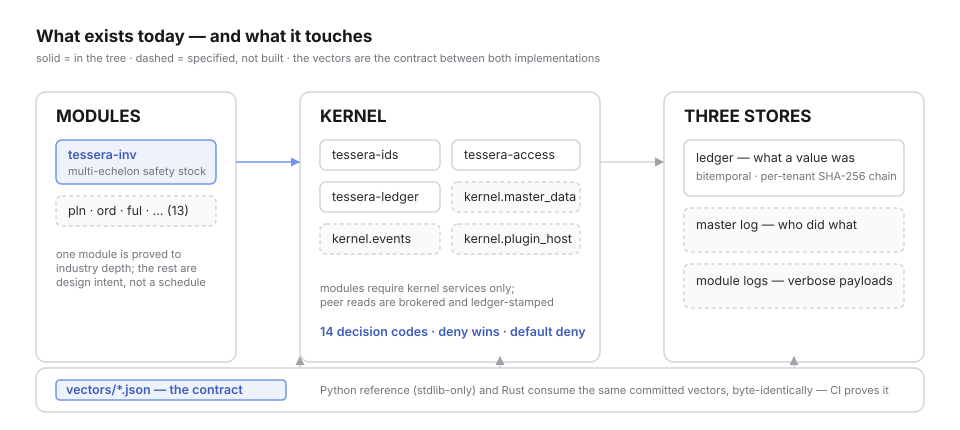

<picture>
  <source media="(prefers-color-scheme: dark)" srcset="brand/mark-dark.svg">
  
</picture>

# Tessera

**One supply chain kernel. Real recommendations you can audit, from
inventory to contracts, without giving up control of your data.**

Status: **the kernel is real and tested** — the permission engine, the
hash-chained ledger, typed identifiers, the `inv` safety-stock core,
and a Python reference that must agree byte-for-byte on committed
conformance vectors. Run `make test`; the suite is the count.
**Everything else in the docs is specified, not built** — the table
below does not lie.

<picture>
  <source media="(prefers-color-scheme: dark)" srcset="docs/site/src/assets/v0x-architecture-dark.svg">
  
</picture>

<details>
<summary>Design intent — the full kernel-and-modules picture (specified, not built)</summary>

The fourteen-module vision — PLAN to CONNECTORS, the adaptive spine,
the inter-company grid — lives in [docs/](docs/) and the
[system diagram](docs/site/src/assets/tessera-system-architecture.svg). It is
design intent. [ROADMAP.md](ROADMAP.md) explains what is scheduled and
what is not.
</details>

---

## What exists today

| Component | State | Where |
|---|---|---|
| Typed identifiers (`TenantId`, `ModuleId`, …) | **built + tested** | `kernel/ids` |
| Permission engine — 5 layers, 14 decision codes, deny wins | **built + tested** | `kernel/access` |
| Ledger — per-tenant SHA-256 chains, append-only, idempotent replay | **built + tested** | `kernel/ledger` |
| `inv` core — multi-echelon safety stock under staged service levels | **built + tested** | `modules/inv` |
| Python reference + conformance vectors (byte-identical contract) | **built + tested** | `reference/python` |
| CI: fmt/clippy/test, MSRV, platform matrix, coverage, DCO, secrets, supply chain | **in tree** | `.github/workflows` |
| ADRs 0001–0009, RFC process, governance, security policy | **in tree** | `docs/`, root |
| Master data, event bus, plugin host, ingest, grid, agents | **specified only** | `docs/`, ROADMAP |

## The module being proved: `inv`

Multi-echelon safety stock under staged service levels — the real
algorithm supply chains argue about, pinned by conformance vectors
*before* the implementation, including the edge cases (zero demand,
negative lead time, single echelon, service level at 0 and at 1).
The vectors are the specification; the Python reference and the Rust
implementation must both reproduce them byte-for-byte.

## The invariants

Deny always wins. Nothing is visible before its `valid_time`. The
ledger never rewrites history. Every deviation from a recommendation
leaves a record. Each one has a test that fails when violated — the
map is [docs/site/src/TESTING.md](docs/site/src/TESTING.md), and docs that cannot drift
are the only docs that stay true.

## Run it

```bash
git clone https://github.com/atqatq/Tessera.git
cd Tessera
make setup   # Rust toolchain (pinned) + editable Python reference
make test    # full suite: cargo test + reference unittests
```

That is the whole onboarding. A clean machine reaches a passing suite
in under two minutes (measured; the README and CI agree — every
command on this page is executed by CI, and CI fails if an untested
command appears here).

<details>
<summary>Terminal session</summary>
The recording's source is committed at <a href="docs/assets/demo.tape">docs/assets/demo.tape</a> and regenerates with <code>vhs</code>.
</details>

## Why this design

[ADRs 0001–0009](docs/adr/) record the decisions and their costs:
star-not-mesh, three separate stores, bitemporal everything, deny-wins
permissions, vectors as the contract, and cryptography only from
audited crates. [GOVERNANCE.md](GOVERNANCE.md) states who decides and
what happens if the maintainer stops.

## Contributing

Read [CONTRIBUTING.md](CONTRIBUTING.md) — it walks the actual
red-green-refactor cycle this codebase went through, gates included.
Kernel invariant changes start as an RFC
([process](docs/RFC_PROCESS.md)). The
[Code of Conduct](CODE_OF_CONDUCT.md) is enforced; security issues go
to [SECURITY.md](SECURITY.md), never to public issues.

## Legal posture, in one breath

Plain [Apache-2.0](LICENSE) — no added conditions, so SPDX scanners
classify it and legal teams approve it in an afternoon; the §3 patent
grant and its retaliation clause protect downstream infrastructure
([plain language](LICENSING.md)). Contributions arrive under the DCO,
not a CLA. The **name** is a trademark, not a licence condition
([TRADEMARK.md](TRADEMARK.md)): say "built with Tessera" freely; forks
rename. OpenSSF Scorecard runs on every push to `main` and its badge
reports what is, not what is hoped.
